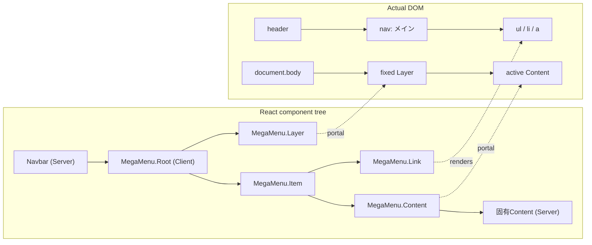

# Navbar・メガメニュー設計レビュー資料

| 項目 | 内容 |
| --- | --- |
| ステータス | 採用方針（キーボード操作の一部は保留） |
| 基準実装 | Next.js 16.2.10 / React 19.2.4 |
| 更新日 | 2026-07-23 |
| UIライブラリ | Radix UI / shadcn/ui / Base UIは不使用 |

## 1. この資料の目的

Next.js App Routerで実装したNavbarとメガメニューについて、現在の設計方針、判断理由、責務分担、操作仕様、制約を整理する。

この資料は次の確認に使用する。

- コンポーネント境界が適切か
- Server Componentの利点を維持できているか
- リンクとしてのセマンティクスとメガメニュー操作を両立できているか
- Portalを使う理由と、その影響をチーム内で共有できているか
- アクセシビリティ、レスポンシブ対応、描画方式に追加検討が必要か

## 2. 結論

現在は、Navbar全体をServer Componentとして維持し、メガメニューの開閉に必要な範囲だけを1つのClient islandとしている。

メガメニュー項目は`button`ではなく、遷移先を持つ単一の通常リンクである。マウスホバーで補助的にメガメニューを表示し、クリック、タップ、`Enter`ではリンク先へ遷移する。開閉用シェブロンやDisclosure Buttonは追加しない。

リンクと固有コンテンツは、Reactのコンポーネントツリー上では同じ`MegaMenu.Item`内に配置する。実際に表示するContentだけを`document.body`直下の共有LayerへPortalし、Headerや祖先要素の`overflow`、`transform`、スタッキングコンテキストから切り離す。

`md`未満ではデスクトップ用MegaMenuと右側リンク群を非表示にし、ロゴ右側へ「製品を探す」「ログイン」「カート」のアイコン操作を表示する。製品検索とログインは`document.body`直下へPortalしたネイティブ`dialog`によるBottom sheetを開き、カートだけは通常リンクとして直接遷移する。PortalによるDOM配置と`dialog`のtop layerを併用するため、Bottom sheetもHeaderの`overflow`やスタッキングコンテキストに制限されない。

この方針は、次の条件に適合している。

- 上位項目自体に有効な遷移先がある
- デスクトップではホバーによる内容の先読みを提供したい
- タッチ操作では1回目のタップから遷移させたい
- 3つのメガメニューがそれぞれ異なる構造を持つ
- Navbar全体をClient Componentにしたくない
- Header内部のクリッピング条件に左右されずにパネルを表示したい

キーボードからメガメニューContentへ直接入る最終的な操作方法は、今回の採用判断に含めず保留とする。現在のfocusおよび矢印キー動作は暫定実装である。

## 3. 対象範囲

Navbarはデスクトップでは左から次の要素で構成する。

1. ロゴ
2. 製品（メガメニューあり）
3. ソリューション（メガメニューあり）
4. リソース（メガメニューあり）
5. 右寄せされたログインボタン
6. お客様専用ページ
7. カート

お客様専用ページとカートは、メガメニューを持たない通常のリンクである。メガメニュー上位リンクと共通の見た目を使用する。

スマートフォン幅では、ロゴの左にハンバーガーボタン、右に「製品を探す」「ログイン」「カート」のアイコン操作を表示する。製品検索とログインはBottom sheetを開き、カートは`/cart`へ遷移する。ハンバーガーボタンだけは引き続き配置確認用の無効なボタンであり、ドロワーの開閉は今後の対象とする。

### 対象外

現時点では、次を対象外としている。

- Radix UI、shadcn/ui、Base UIへの依存
- ARIA `menu` / `menuitem`パターン
- モバイル専用ドロワーの開閉（ハンバーガーボタンの表示位置のみ対象）
- パネルの高度な衝突検出や自動反転
- CMSやAPIからの実データ取得
- 認証状態によるNavbar項目の出し分け

## 4. 主要な設計判断

| 論点 | 現在の判断 | 理由 |
| --- | --- | --- |
| Navbarの実行環境 | Server Component | Navbar全体のhydrationとClient JavaScriptを避ける |
| インタラクティブ境界 | `MegaMenu.Root`以下の制御部分だけClient Component | 3項目でactive状態、タイマー、Layer、位置を共有するため |
| 上位項目のHTML要素 | Next.jsの`Link`、実DOMは`a` | 項目自体が遷移先を持つため |
| マウス操作 | ホバーで開閉 | 内容を先読みできるデスクトップ向け補助操作 |
| タッチ操作 | タップで直接遷移 | 「1回目で開き、2回目で遷移」という挙動を採用しない |
| キーボード操作 | Contentへの入り方は保留 | 現在のfocus／矢印キー操作を確定仕様としない |
| React上の構造 | LinkとContentを同じItem内に置く | 対応関係、固有構造、保守性を明示する |
| 実DOM上の構造 | activeなContentをbody直下へPortal | Header祖先のクリッピングとスタッキングコンテキストを回避する |
| Contentの構造 | メニューごとのServer Component | 各メニューの構造が異なるため、過度にデータ駆動化しない |
| アイコン | Linkの静的childrenとして渡す | 開閉状態を管理する部品ではなく、項目固有の表示だから |
| 開閉用シェブロン | 追加しない | 項目全体を単一Linkとして維持するため |
| デスクトップ右側リンク | 専用コンポーネント化しない | 現状は右寄せレイアウト以外の独立責務がないため |
| スマホ右側操作 | Navbar内へ直接宣言 | MegaMenuと同様にTrigger、Content、遷移先の対応を上位構造から読めるようにするため |
| Bottom sheet描画 | body Portal + ネイティブ`dialog`のtop layer | 実DOMをHeaderから分離し、モーダルのフォーカス制約をブラウザへ委ねるため |

## 5. コンポーネント構成

```text
Navbar                                      Server Component
├─ Hamburger button                        disabled placeholder
├─ SiteLogo                                 Server Component
├─ MegaMenu.Root (nav)                      desktop Client Component
│  ├─ MegaMenu.List                         Client shell
│  │  ├─ MegaMenu.Item                      Client shell
│  │  │  ├─ MegaMenu.Link                   Client interaction + Link
│  │  │  └─ MegaMenu.Content                Client portal wrapper
│  │  │     └─ ProductsMegaMenuContent      Server Component
│  │  ├─ MegaMenu.Item
│  │  │  └─ SolutionsMegaMenuContent        Server Component
│  │  └─ MegaMenu.Item
│  │     └─ ResourcesMegaMenuContent        Server Component
│  └─ MegaMenu.Layer                        Client portal host
├─ Login / Customer page / Cart             desktop Server-rendered links
└─ BottomSheet.Root (div)                   mobile Client Component
   ├─ BottomSheet.Item                      value: product-search
   │  ├─ BottomSheet.Trigger                Product search icon button
   │  └─ BottomSheet.Content                body Portal + native dialog
   │     └─ ProductSearchBottomSheetContent
   ├─ BottomSheet.Item                      value: login
   │  ├─ BottomSheet.Trigger                Login icon button
   │  └─ BottomSheet.Content                body Portal + native dialog
   │     └─ LoginBottomSheetContent
   └─ Cart                                  Server-rendered Link
```

### React上の所有関係とDOM配置



PortalはDOMの描画先だけを変える。React Context、コード上の所有関係、合成イベントの伝播は元のReactツリーに従う。一方、ブラウザと支援技術が認識する親子関係やフォーカス順は実DOMとARIAに従う。

`BottomSheet`は仕組みだけを見れば汎用化できるが、現時点の利用者とライフサイクルはNavbar内に限定される。そのため`src/components/ui`へ先回りして配置せず、`Navbar/BottomSheet`へコロケーションする。Navbar以外に独立した利用者が生まれ、APIとスタイルを共通契約として維持する必要が出た時点で、共有UIへの昇格を検討する。

`MegaMenu/`にも同じ境界を適用する。Root、List、Item、Link、Content、Layerなど開閉機構を構成するCompound Componentsだけをディレクトリ内に置き、製品・ソリューション・リソース固有のServer ContentはNavbar直下に置く。これにより「仕組み」と「Navbarが宣言する中身」をファイル配置でも区別する。

Bottom SheetでもPortalはReact上の所有関係を変えない。TriggerとContentは同じ`BottomSheet.Item`内にあり、複数Itemを単一`BottomSheet.Root`が管理する。一方、active Itemの`dialog`実DOMだけが`document.body`直下に置かれる。`createPortal`はDOM配置を、`showModal()`はtop layer、モーダルフォーカス、backdropを担当する。

`BottomSheet.Root`はContext Providerに加えてモバイルアクション群の`div`を描画する。Navbar固有のレイアウトclassはRoot内部へ固定せず、`Navbar.tsx`から通常の`div`属性として渡す。Bottom Sheetを開かないカートリンクも、同じ表示グループに属する子要素としてRoot直下へ置く。

Bottom Sheetの表示時は、本体だけを280msかけて48px下から定位置へ移動させる。backdropは動かさず、`prefers-reduced-motion: reduce`では本体のアニメーションも無効化する。

Sheet本体はビューポート下端へ固定し、高さを`calc(100dvh - 70px)`とする。これにより、画面の高さや内容量にかかわらず本体上辺をビューポート上端から70pxの位置へ揃え、超過する内容だけを本体内でスクロールさせる。

閉じるボタンはSheet内部のヘッダー行に含めず、Sheet本体の右上辺から8px上へ配置する。本体とは重ねない。`dialog`をoverflow可能な外枠、本体を角丸とスクロールを担当する内側要素に分け、ボタンが本体のクリップ領域で切れないようにする。

Navbarのcomposition layerでは、MegaMenuとBottom SheetのどちらもRoot、Item、TriggerまたはLink、Content、固有Contentを直接宣言する。`MobileNavbarActions`のような状態を持たない中間コンポーネントでは包まない。これにより、デスクトップとスマートフォン双方の遷移先と展開内容を`Navbar.tsx`だけで追跡できる。

Bottom SheetはItemごとにRootを作らず、単一Rootが`activeValue`を所有する。これにより、同時に開けるSheetを1つに限定し、body scroll lock、route変更、breakpoint変更、フォーカス復帰の監視と状態を重複させない。

デスクトップ／スマートフォンの境界はNavbar全体の方針なので、`DESKTOP_NAVIGATION_MEDIA_QUERY`をNavbar直下で共有する。Navbar専用機構である`MegaMenu.Root`と`BottomSheet.Root`がそれぞれ直接参照し、各利用箇所から同じ値をpropsで繰り返し渡さない。

## 6. 各コンポーネントの責務

### `Navbar`

担当すること：

- Navbar全体の意味構造と項目順序
- 各Item、Link、固有Contentの宣言的な組み合わせ
- Server Componentとして固有ContentをClient shellの`children`へ渡すこと
- ロゴ、ログイン、お客様専用ページ、カートの配置
- デスクトップ用UIとスマートフォン用UIの宣言的な配置

担当しないこと：

- active状態
- hover、focus、タイマー
- DOM計測
- Portal

### `NavbarMenuItem`

担当すること：

- Next.js `Link`としてのセマンティクス
- Navbar項目に共通するclassの付与
- 高さ、余白、文字とアイコンの配置
- hover、focus-visible、active、openの見た目

担当しないこと：

- メガメニューの有無の判断
- 開閉状態の保持
- Contentとの関連付け
- Portalや位置計算

このコンポーネントには`"use client"`を付けていない。通常リンクから使う場合はServer側で扱い、`MegaMenu.Link`からimportされた場合だけclient graphに含まれる。

### `MegaMenu.Root`

メガメニュー全体の制御単位である。

担当すること：

- `nav`要素によるナビゲーションランドマークの提供と、呼び出し側から受け取るアクセシブルネーム
- activeなItemの`value`とanchor要素のref
- 共有Layerのslot
- closeタイマー
- NavbarとPortal slotの外側で発生したpointer downによるclose
- 暫定キーボード操作における`Escape`処理
- `Escape`でfocusを戻す際の意図しない再openの抑止
- route変更時のclose
- scroll、resize時の表示位置更新

3つのItemを別々のClient islandにしないのは、active Itemの切り替え、closeタイマー、位置、Layerを協調させる必要があるためである。

### `MegaMenu.Item`

担当すること：

- LinkとContentを論理的にグルーピングすること
- Item固有の`value`
- LinkとContentを関連付けるIDの生成

Item自体はContentの構造や表示内容を知らない。

### `MegaMenu.Link`

概念上はメガメニューのTriggerでもあるが、HTML上の本質は遷移リンクである。

担当すること：

- `NavbarMenuItem`を使ったリンク描画
- mouseの`pointerenter`でopen
- mouseの`pointerleave`で遅延close
- 暫定動作としてのkeyboard focusによるopen
- 暫定動作としての`ArrowDown` / `ArrowUp`によるフォーカス移動
- 現行実装の`aria-expanded`、`aria-controls`、`data-state`
- touch / pen由来のfocusではopenしないこと

意図的に担当しないこと：

- click、tap、`Enter`による開閉トグル
- アイコンの選択や状態変更

click handlerは遷移開始時にactive状態を閉じるだけで、`preventDefault`を呼ばない。したがって、クリック、タップ、`Enter`はNext.js `Link`の通常遷移になる。

focus、矢印キー、`Escape`、`aria-expanded`の最終仕様は今回の検討範囲外であり、現在の実装を確定仕様とはしない。

### `MegaMenu.Content`

担当すること：

- 自身が属するItemがactiveかの判定
- active時だけ固有Contentを共有Layer slotへPortal
- Triggerと関連付けられた`region`の提供
- Content内へポインターまたはフォーカスが移った際のcloseキャンセル
- Content外へ離れた際の遅延close

担当しないこと：

- 固有Contentのレイアウト
- 固有リンクや見出しのデータ
- body直下のLayer生成

### `MegaMenu.Layer`

担当すること：

- hydration後に`document.body`直下へPortal hostを生成
- Contentが描画される共有slotの提供
- `position: fixed`、z-index、横幅の基準となるDOMの提供

Layerは固有Contentを直接選択しない。どのContentを表示するかは、各`MegaMenu.Content`がItem ContextとRoot Contextを使って判断する。

### 各`*MegaMenuContent`

担当すること：

- メニューごとに異なる見出し、カード、リンク、グリッド構造
- 必要に応じたServer側データ取得
- Content内の意味構造

Client制御ファイルからこれらをimportしないことが重要である。`Navbar`からReact NodeとしてClient wrapperの`children`へ渡すことで、固有Contentの実装をClient bundleへ引き込まない。

## 7. Server ComponentとClient Componentの境界

現在のimport方向は次のとおりである。

```text
Navbar (Server)
├─ imports MegaMenu named Client Components
├─ imports ProductsMegaMenuContent (Server)
├─ imports SolutionsMegaMenuContent (Server)
└─ imports ResourcesMegaMenuContent (Server)

MegaMenu/index.ts（公開Client entrypoint）
├─ re-exports Root / List / Item / Link / Content / Layer
└─ does not import or re-export any menu-specific Server Component
```

`"use client"`は公開facadeである`MegaMenu/index.ts`に置く。分割した内部モジュールはこのfacadeから到達するため同じClient graphへ入り、Navbarから内部ファイルをdeep importしない。

Server ComponentはClient Contextを参照できない。そのため、active判定はClient側の`MegaMenu.Content`が行い、その内側に渡されたServer Componentは表示内容の生成だけを担う。

これにより次を維持する。

- Navbar全体をClient Componentにしない
- ロゴと通常リンクをServer側で描画する
- 固有Contentのデータ取得、キャッシュ、秘密情報へのアクセスをServer側へ置ける
- ブラウザへ送るClient JavaScriptを開閉制御の範囲に限定する

### 注意点

body PortalはブラウザDOMが必要なため、LayerとパネルDOMはhydration後に生成される。固有ContentがServer Componentであっても、「展開前の全パネルDOMが初期HTMLのbodyに存在する」という意味ではない。

一方、Navbarから`children`として渡したすべての固有Server Componentは、active状態に関係なくサーバー側で事前にレンダリングされ、その結果がRSC Payloadに含まれる。activeなContentだけをDOMへPortalする設計であり、Server Componentの処理、データ取得、RSC Payloadを遅延させる設計ではない。

JavaScriptが利用できない場合でも、上位項目は通常のリンクなのでカテゴリページへ遷移できる。カテゴリページ側に同等の子リンクを用意することを、progressive enhancement上の前提とする。

## 8. 操作仕様

| 入力 | 上位リンクの動作 | メガメニューの動作 |
| --- | --- | --- |
| mouse pointer enter | 遷移しない | 対象Contentを開く |
| mouse pointer leave | 遷移しない | 180ms後に閉じる |
| Contentへpointer移動 | 遷移しない | close予約をキャンセル |
| click | リンク先へ遷移 | 開閉トグルはせず、遷移開始時に閉じる |
| touch / pen tap | リンク先へ遷移 | tapでは開閉しない |
| `Enter` | リンク先へ遷移 | Enterでは開閉しない |
| 外側pointer down | 対象要素本来の操作 | メガメニューを閉じる |
| route変更 | 新しいrouteを表示 | active状態を閉じる |

次のキーボード動作は現行デモに存在するが、採用仕様ではなく保留事項である。

| 入力 | 現在の暫定動作 |
| --- | --- |
| keyboard focus | 対象Contentを表示 |
| `ArrowDown` | 開いて先頭の操作要素へ移動 |
| `ArrowUp` | 開いて末尾の操作要素へ移動 |
| `Escape` | 閉じて上位リンクへフォーカスを戻す。復帰focusでは再openしない |

### TriggerとContentの接続

Contentの上辺はTriggerの下辺へ直接接触させる。位置は`getBoundingClientRect().bottom`をそのまま使用し、物理的な空白を設けない。このため、透明なpointer bridgeおよびsafe polygonは採用しない。

closeの短い遅延は、空白を越えるためではなく、境界上のわずかなポインター揺れを吸収する暫定的なUI調整である。

現在値は次のとおりである。

- pointer leave: 180ms
- focus leave: 120ms

この値は設計上の確定値ではなく、実機とユーザーテストで調整可能なUIパラメーターである。

## 9. セマンティクスとアクセシビリティ

### 採用しているセマンティクス

- `MegaMenu.Root`は`aria-label="メイン"`を持つ`nav`、その直下に製品、ソリューション、リソースの`ul` / `li`
- ロゴは`nav`の外側にあるホームリンク
- ログイン、お客様専用ページ、カートは`aria-label="お客様専用ページとカート"`を持つ別`nav`
- 上位項目は`a`
- 各メガメニューリンクはラベルと内容に対応した`sr-only`のサブテキストを内包する。サブテキストは将来のスマートフォン用ドロワーで可視化し、リンク全体をクリック領域にする
- 展開領域は`role="region"`
- `aria-labelledby`で上位リンクを領域名として使用
- open中は上位リンクへ`aria-expanded="true"`
- open中は`aria-controls`でContent IDを参照

### `menu`ロールを使用しない理由

これはWebサイト内のページ遷移ナビゲーションであり、デスクトップアプリケーション風のコマンドメニューではない。リンクの通常Tab移動とブラウザ標準動作を維持するため、ARIA `menu` / `menuitem`パターンは採用していない。

### 現在のフォーカス順

PortalされたContentはbody側のDOMに置かれるため、React上でLinkとContentが同じItemにあっても、自然なTab順が両者の間に作られるわけではない。

キーボードからContentへ直接入る必要性と、その場合のTab／矢印キー操作は今回の検討範囲外として保留する。現在の`ArrowDown` / `ArrowUp`は暫定動作であり、確定したアクセシビリティ仕様を表すものではない。

## 10. Portalとレイアウト

### Portalを採用した理由

通常の子要素としてHeader内にContentを置くと、次の影響を受ける。

- `overflow: hidden` / `clip` / `auto`によるクリッピング
- `transform`、`filter`、`opacity`などが作るスタッキングコンテキスト
- 祖先のz-index階層
- fixed containing blockの変化

現在は検証のため、Header自体に`overflow: hidden`を設定している。それでもパネルはbody直下にあるため切れずに表示できる。

### 現在の位置決め

- Layer: `position: fixed`
- 水平方向: viewport中央、最大幅1120px
- 垂直方向: active Linkの`getBoundingClientRect().bottom`を丸めずに使用（上下辺を接触）
- scroll / resize時: active Linkを再計測
- パネル高: viewportに応じた最大高と内部scroll
- z-index: Headerより上のLayer値

### 現在実装していない配置機能

- viewport上下端に応じた自動反転
- Triggerごとの横方向alignment
- scrollbar幅を考慮した精密補正
- visual viewportを考慮したモバイルキーボード対応
- 複数Header高さや告知バーを考慮した専用anchor

これらが必要になった時点で、独自の簡易位置計算を拡張するか、Floating UI等のpositioning専用ライブラリを検討する。

## 11. アイコンの扱い

`NavigationMenu.Icon`に相当する専用コンポーネントは設けていない。

理由は次のとおりである。

- アイコンはItem固有の静的表示である
- open、hover、activeによってアイコン自体を差し替えない
- MegaMenu制御がアイコンの種類を知る必要がない
- labelと同じLink childrenとして読む方が構造が明確である
- アイコン本体には`lucide-react`を使い、Navbar専用の薄いラッパーは設けない

現在の記述イメージ：

```tsx
<MegaMenu.Item value="products">
  <MegaMenu.Link href="/products">
    <Layers3 aria-hidden="true" />
    <span>製品</span>
  </MegaMenu.Link>
  <MegaMenu.Content>
    <ProductsMegaMenuContent />
  </MegaMenu.Content>
</MegaMenu.Item>
```

アイコンが開閉アニメーション、状態表示、アクセシブルなラベルを担うようになった場合に限り、専用責務の追加を再検討する。

## 12. Radix UI / shadcn/uiを使用しない判断

今回必要なのは、主に次の機能である。

- active Itemの共有
- hover制御と暫定的なfocus制御
- Contentとの関連付け
- body Portal
- anchor位置の計測

一方、採用したい操作モデルは「hoverで展開し、click / tapではリンク遷移」であり、ライブラリ標準のTrigger buttonやtap-to-openモデルと一致するとは限らない。

そのため現時点では、ライブラリの部品構造に仕様を合わせるより、小さいClient shellとして要件を直接表現している。将来ライブラリを導入する場合も、次を先に確認する必要がある。

- Triggerを実リンクとして維持できるか
- tapをopenに使わず遷移させられるか
- 開閉用シェブロンや別Buttonを要求しないか
- Contentの論理的な隣接を維持できるか
- Portal先とpositioningを制御できるか
- Server Componentの固有Contentをslotとして渡せるか

## 13. 現在の実装ファイル

| ファイル | 役割 |
| --- | --- |
| `src/components/Navbar/index.ts` | CMS統合時にも利用できるServer Component公開エントリ |
| `src/components/Navbar/Navbar.tsx` | Server側のNavbar構成とItem宣言 |
| `src/components/Navbar/NavbarMenuItem.tsx` | Navbar固有の共通リンクUI |
| `src/components/Navbar/SiteLogo.tsx` | ロゴリンク |
| `src/components/Navbar/ProductSearchBottomSheetContent.tsx` | 製品検索Bottom SheetのServer Content |
| `src/components/Navbar/LoginBottomSheetContent.tsx` | ログインBottom SheetのServer Content |
| `src/components/Navbar/constants.ts` | デスクトップ／スマホ切り替えの共通Media Query |
| `src/components/Navbar/MegaMenu/index.ts` | Compound Componentsを明示的にre-exportする公開Client entrypoint |
| `src/components/Navbar/MegaMenu/MegaMenuRoot.tsx` | `nav`ランドマーク、active状態、timer、位置計算、outside・route・Escape制御 |
| `src/components/Navbar/MegaMenu/MegaMenuList.tsx` | Navbar項目を格納する`ul` |
| `src/components/Navbar/MegaMenu/MegaMenuItem.tsx` | Item Context、value、LinkとContentのID関連付け |
| `src/components/Navbar/MegaMenu/MegaMenuLink.tsx` | 上位リンクとpointer・focus・keyboard操作 |
| `src/components/Navbar/MegaMenu/MegaMenuContent.tsx` | active Contentの判定、ARIA、共有slotへのPortal |
| `src/components/Navbar/MegaMenu/MegaMenuLayer.tsx` | body直下のPortal hostと配置基準 |
| `src/components/Navbar/MegaMenu/MegaMenuRootContext.ts` | Root Contextの型、Context、専用hook |
| `src/components/Navbar/MegaMenu/MegaMenuItemContext.ts` | Item Contextの型、Context、専用hook |
| `src/components/Navbar/MegaMenu/constants.ts` | close delayとfocus対象selector |
| `src/components/Navbar/ProductsMegaMenuContent.tsx` | 製品固有のServer Content |
| `src/components/Navbar/SolutionsMegaMenuContent.tsx` | ソリューション固有のServer Content |
| `src/components/Navbar/ResourcesMegaMenuContent.tsx` | リソース固有のServer Content |
| `src/components/Navbar/BottomSheet/index.ts` | Navbar内のBottom Sheet Compound Componentsを公開するClient entrypoint |
| `src/components/Navbar/BottomSheet/BottomSheetRoot.tsx` | 単一activeValue、route／breakpoint close、scroll lock、focus復帰 |
| `src/components/Navbar/BottomSheet/BottomSheetItem.tsx` | valueとTrigger／Content固有IDの関連付け |
| `src/components/Navbar/BottomSheet/BottomSheetTrigger.tsx` | icon buttonとdialogのARIA関連付け |
| `src/components/Navbar/BottomSheet/BottomSheetContent.tsx` | native dialogのbody Portal／top layer表示、backdrop装飾、Escape／閉じるボタン操作 |
| `src/components/Navbar/BottomSheet/BottomSheetRootContext.ts` | Bottom Sheet Contextの型、Context、専用hook |
| `src/components/Navbar/BottomSheet/BottomSheetItemContext.ts` | Item Contextの型、Context、専用hook |
| `src/app/globals.css` | Tailwindの読込、デザイントークン、入場アニメーション定義 |

表示スタイルは各コンポーネントのTailwind utility classとして記述する。`globals.css`へコンポーネント固有のセレクタは置かず、Portalで描画されるLayerとContentも同じ方針で扱う。

## 14. 検証済み事項

自動検証：

- ESLint成功
- TypeScript `--noEmit`成功
- Next.js production build成功

ブラウザ確認：

- 暫定動作として`ArrowDown`でContentを開き、最初のリンクへ移動できる
- `Escape`で上位リンクへfocusを戻した後、Contentが再openしない
- 上位リンクのclickでカテゴリページへ遷移する
- 外側のpointer downでContentが閉じる
- Trigger下辺とContent上辺の差が`0px`である
- active ContentがHeader配下ではなく`document.body`直下のLayer内に存在する
- Headerが`overflow: hidden`でもContentがクリップされない
- 3種類の固有Contentがそれぞれ単独で表示される
- 390pxおよび320px幅で、ハンバーガー、ロゴ、3つのスマホ用アイコン操作がHeader内に収まる
- 製品検索とログインのBottom sheetが各Triggerから開く
- 開いているBottom sheetの`dialog`がHeader配下ではなく`document.body`直下に存在する
- Bottom sheetのbackdropをクリックしても閉じない
- Bottom sheet本体だけが下部から控えめに表示され、backdropは動かない
- Bottom sheetを`Escape`または閉じるボタンで閉じ、Triggerへfocusが戻る
- スマホからデスクトップ幅へ切り替えたとき、開いていたBottom sheetが閉じる
- カートだけがBottom sheet Triggerではなく`/cart`への通常リンクである
- ブラウザconsoleにwarning / errorがない

## 15. レビューで確認したい事項

### 採用済みの操作仕様

- [x] 上位項目は単一Linkとし、開閉用シェブロン／Buttonを追加しない
- [x] 上位項目を「hoverで展開、click / tapで直接遷移」とする
- [x] Trigger下辺とContent上辺を接触させ、pointer bridgeを使わない
- [ ] hover closeの180msは実機確認後に調整する
- [ ] Contentから別のNavbar項目へ移る際の切り替え感を実機で確認したか

### 今回の検討範囲外

- [ ] キーボードからContentへ直接入る必要性
- [ ] focusで自動表示するか
- [ ] `Tab`、`Shift+Tab`、`ArrowDown`、`ArrowUp`の最終操作
- [ ] `Escape`後のフォーカス復帰
- [ ] Linkの`aria-expanded`と`aria-controls`の最終判断

これらは未承認ではなく、今回の優先範囲に含めず保留として管理する。現行デモの動作を確定仕様と解釈しない。

### 後続のアクセシビリティ確認

- [ ] スクリーンリーダーで`aria-expanded`と`region`の関係を確認したか
- [ ] 通常Tab順でContentへ入らない現在のモデルを許容するか
- [ ] focus-visibleがHeaderの`overflow: hidden`で欠けないか
- [ ] zoom 200%および文字サイズ拡大時に操作可能か
- [ ] prefers-reduced-motion時の表示を確認したか

### レスポンシブとタッチ

- [ ] Navbar全体の最小幅720pxはプロダクト要件に適合するか
- [x] `md`未満でデスクトップ用Navbar項目とスマホ用アイコン操作を切り替える
- [ ] ハンバーガーボタンから開くモバイル専用ドロワーを実装する
- [ ] 製品検索／ログインBottom sheetをiOS Safari、Android Chromeで検証する
- [ ] iOS Safari、Android Chromeで1回目のtapが確実に遷移するか
- [ ] hover可能なタッチ端末で意図しないopenが起きないか

### Portalと配置

- [ ] Layerのz-indexがモーダル、トースト、Cookieバナーと整合するか
- [ ] Header以外の告知バーが追加された場合も位置が正しいか
- [ ] viewport高さが低い環境で内部scrollが操作しやすいか
- [ ] Contentが初期HTMLに存在しないことをSEO・クローラ要件上許容するか

### Server / Client境界

- [ ] 固有ContentからClient専用hookを直接使う必要がないか
- [ ] 認証やデータ取得をNavbar Server Component側に置く方針でよいか
- [ ] Client bundle解析で固有Content実装が混入していないことを確認するか

## 16. 採用条件が変わった場合の見直し

次の場合は現在の方式を再検討する。

| 条件変更 | 再検討する内容 |
| --- | --- |
| 上位項目に遷移先がなくなる | Linkではなくbutton Triggerへ変更 |
| tapで開く要件になる | touch向け状態モデル、2回目tap、outside close |
| Contentを初期HTMLへ常時出したい | non-Portal host、CSS表示切替、Server側DOM配置 |
| Headerのクリッピング制約がなくなる | Header内Viewportで十分か再評価 |
| 複雑な衝突検出が必要になる | Floating UI等のpositioning導入 |
| 各ContentでClient操作が増える | Content内部に小さいClient islandを追加 |
| Navbar項目が動的に大量生成される | 設定データとContent registryの導入を検討 |

## 17. 現時点の推奨

現在の要件では、次の方針を維持する。

1. NavbarはServer Componentのままにする。
2. 共有状態を必要とするメガメニュー制御だけを1つのClient islandにする。
3. 上位項目は実リンクとして維持し、click / tapを開閉処理で上書きしない。
4. LinkとContentを同じItemに置き、対応関係をJSXで明示する。
5. 固有ContentはServer Componentとして分離し、Client制御層からimportしない。
6. body Portalを使い、Header祖先のlayout制約からパネルを分離する。
7. アイコンはLink childrenとして扱い、専用の状態管理部品を作らない。
8. 開閉用シェブロン／Buttonは追加しない。
9. Trigger下辺とContent上辺を直接接触させ、pointer bridgeは使用しない。
10. キーボードからContentへ入る方法は今回決定せず、後続検討とする。
11. 本番採用前に、スクリーンリーダー、実タッチ端末、狭いviewport、他Layerとのz-indexを追加検証する。
