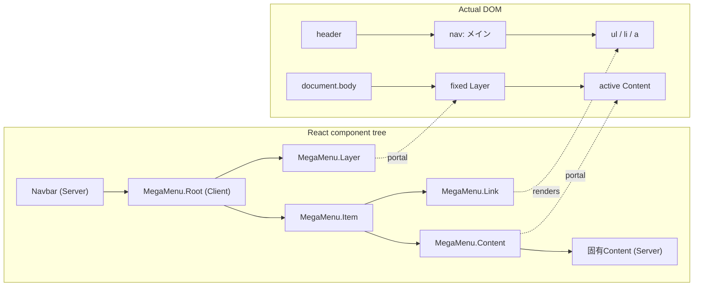

# Navbar・メガメニュー設計レビュー資料

| 項目 | 内容 |
| --- | --- |
| ステータス | 採用方針（キーボード操作の一部は保留） |
| 基準実装 | Next.js 16.2.10 / React 19.2.4 |
| 更新日 | 2026-08-07 |
| UIライブラリ | Radix UI / shadcn/ui / Base UIは不使用 |

## 1. この資料の目的

Next.js App Routerで実装したNavbarとメガメニューについて、現在の設計方針、判断理由、責務分担、操作仕様、制約を整理する。

この資料は次の確認に使用する。

- コンポーネント境界が適切か
- Server Componentの利点を維持できているか
- リンクとしてのセマンティクスとメガメニュー操作を両立できているか
- Portalを使う理由と、その影響をチーム内で共有できているか
- アクセシビリティ、レスポンシブ対応、描画方式に追加検討が必要か

## 2. 結論

現在は、Navbar全体をServer Componentとして維持し、MegaMenu、Drawer、PushNav、Bottom Sheetの制御に必要な範囲だけをClient shellとしている。

メインナビゲーション上位3項目は`button`ではなく、遷移先を持つ単一の通常リンクである。マウスホバーで補助的にメガメニューを表示し、クリック、タップ、`Enter`ではリンク先へ遷移する。上位3項目には開閉用シェブロンやDisclosure Buttonを追加しない。認証済みかつ商品ありのデスクトップCartにも同じLink Triggerを適用する。一方、デスクトップの認証済み表示では、遷移を目的としないユーザー名の`button`をAccountパネルのTriggerとして使用する。

リンクと固有コンテンツは、Reactのコンポーネントツリー上では同じ`MegaMenu.Item`内に配置する。実際に表示するContentだけを`document.body`直下の共有LayerへPortalし、Headerや祖先要素の`overflow`、`transform`、スタッキングコンテキストから切り離す。

`md`未満ではデスクトップ用MegaMenuと右側リンク群を非表示にする。ロゴ左側のハンバーガーボタンは`document.body`直下へPortalしたネイティブ`dialog`によるDrawerを開き、ロゴ右側には「製品を探す」「ログイン」「カート」のアイコン操作を表示する。製品検索とログインは同じ描画方式のBottom sheetを開く。カートはログイン済みかつ商品ありの場合だけBottom sheetを開き、それ以外は通常リンクとして直接遷移する。PortalによるDOM配置と`dialog`のtop layerを併用するため、DrawerとBottom sheetはHeaderの`overflow`やスタッキングコンテキストに制限されない。

この方針は、次の条件に適合している。

- メインナビゲーション上位3項目自体に有効な遷移先がある
- デスクトップではホバーによる内容の先読みを提供したい
- タッチ操作では1回目のタップから遷移させたい
- 3つのメガメニューがそれぞれ異なる構造を持つ
- Navbar全体をClient Componentにしたくない
- Header内部のクリッピング条件に左右されずにパネルを表示したい

キーボードからメガメニューContentへ直接入る最終的な操作方法は、今回の採用判断に含めず保留とする。現在のfocusおよび矢印キー動作は暫定実装である。

## 3. 対象範囲

Navbarはデスクトップでは左から次の要素で構成する。

1. ロゴ
2. 製品（メガメニューあり）
3. ソリューション（メガメニューあり）
4. リソース（メガメニューあり）
5. 右寄せされたログインリンク、または認証済みユーザー名ボタン
6. お客様専用ページ（未ログイン時のみ直置き。ログイン時はAccountパネル内）
7. カート

未ログイン時のログイン、お客様専用ページ、カートは通常のリンクである。ログイン時はログインリンクと直置きのお客様専用ページリンクをユーザー名ボタンへ集約し、同ボタンから開くAccountパネル内にお客様専用ページへの導線を置く。カートは常に`/cart`へのリンクであり、認証済みかつ商品ありの場合だけ、デスクトップではホバーでCartパネルも表示する。

スマートフォン幅では、ロゴの左にハンバーガーボタン、右に「製品を探す」「ログイン」「カート」のアイコン操作を表示する。ハンバーガーボタンはモーダルDrawerを開く。製品・ソリューション・リソースは`button`として各カテゴリ画面を右から左へpushし、各画面内の最終リンクだけがページ遷移する。製品検索とログインはBottom sheetを開く。カートはログイン済みかつ商品ありならBottom sheetを開き、それ以外は`/cart`へ遷移する。

### 対象外

現時点では、次を対象外としている。

- Radix UI、shadcn/ui、Base UIへの依存
- ARIA `menu` / `menuitem`パターン
- `PushNav`の内部履歴とブラウザ履歴／端末Back操作の連携
- パネルの高度な衝突検出や自動反転
- CMSやAPIからの実データ取得

## 4. 主要な設計判断

| 論点 | 現在の判断 | 理由 |
| --- | --- | --- |
| Navbarの実行環境 | Server Component | Navbar全体のhydrationとClient JavaScriptを避ける |
| インタラクティブ境界 | 各`MegaMenu.Root`以下の制御部分だけClient Component | メイン上位3項目は1つのRootで状態を共有し、認証済みAccount領域は別の`nav`ランドマークとして独立させるため |
| メイン上位3項目のHTML要素 | Next.jsの`Link`、実DOMは`a` | 項目自体が遷移先を持つため |
| マウス操作 | ホバーで開閉 | 内容を先読みできるデスクトップ向け補助操作 |
| タッチ操作 | タップで直接遷移 | 「1回目で開き、2回目で遷移」という挙動を採用しない |
| キーボード操作 | Contentへの入り方は保留 | 現在のfocus／矢印キー操作を確定仕様としない |
| React上の構造 | LinkとContentを同じItem内に置く | 対応関係、固有構造、保守性を明示する |
| 実DOM上の構造 | activeなContentをbody直下へPortal | Header祖先のクリッピングとスタッキングコンテキストを回避する |
| Contentの水平配置 | 既定はviewport中央、Account／Cartは`trigger-end` | 大型パネルは画面基準、コンパクトな右側パネルは各Triggerの右辺基準にするため |
| Contentの構造 | メニューごとのServer Component | 各メニューの構造が異なるため、過度にデータ駆動化しない |
| 上位3項目のメタデータ | `primaryNavigationItems`で共有 | value、href、label、サブテキスト、LucideアイコンをMegaMenuとPushNavで一致させるため |
| アイコン | Linkの静的childrenとして渡す | 開閉状態を管理する部品ではなく、項目固有の表示だから |
| 開閉用シェブロン | 追加しない | 項目全体を単一Linkとして維持するため |
| デスクトップ認証表示 | 未ログイン時はログインLink、ログイン時はユーザー名の`MegaMenu.Trigger` | 遷移とAccountパネル開閉のセマンティクスを認証状態に応じて分けるため |
| Account Content | MegaMenu／PushNavで共有するServer Component | Account固有の導線を共有し、PushNavの戻る操作は外側のshellへ分離するため |
| デスクトップCart | 商品ありの場合も`MegaMenu.Link`、商品なしは通常Link | ホバーでは内容を先読みし、click／tap／`Enter`では常に`/cart`へ遷移するため |
| Cart Content | MegaMenu／Bottom Sheetで共有するServer Component | 同じ商品あり表示を描画shellから独立させるため |
| スマホ右側操作 | Navbar内へ直接宣言 | MegaMenuと同様にTrigger、Content、遷移先の対応を上位構造から読めるようにするため |
| Drawer描画 | body Portal + ネイティブ`dialog`のtop layer | Header祖先のクリッピングを避け、モーダル操作をブラウザへ委ねるため |
| Drawer内の階層移動 | Navbarローカルな`PushNav` Compound Components | Drawerのモーダル責務と画面履歴／push遷移を分離するため |
| PushNavのcomposition | `Navbar`でRoot、Screen、Server Contentを直接対応付ける | 画面遷移の構造を上位から追跡し、構成だけの中間コンポーネントを置かないため |
| PushNavの画面値 | `as const`のtupleから導出したunion型 | `Trigger.to`、`Screen.value`、履歴、Contextの文字列を同じ許可値へ制限するため |
| モバイル上位項目 | `PushNav.Trigger`が描画する`button` | ページ遷移ではなくDrawer内の画面切り替えだから |
| Bottom sheet描画 | body Portal + ネイティブ`dialog`のtop layer | 実DOMをHeaderから分離し、モーダルのフォーカス制約をブラウザへ委ねるため |

## 5. コンポーネント構成

```text
Navbar                                      Server Component
├─ Drawer.Root                              mobile Client Component
│  ├─ Drawer.Trigger                       hamburger trigger
│  │  └─ NavbarIconItem                    icon button
│  └─ Drawer.Content                       body Portal + native dialog
│     └─ PushNav.Root (nav)                history + focus + clipped stack / Client
│        ├─ PushNav.Screen                 value: root / Client shell
│        │  └─ RootPushNavContent          Server Component
│        │     ├─ PushNav.Trigger           authenticated account button / Client
│        │     └─ PushNav.Trigger × 3       category buttons / Client
│        ├─ PushNav.Screen                 value: account / Client shell
│        │  └─ PushNavScreenLayout         shared back control
│        │     └─ AccountNavigationContent shared Server Content
│        ├─ PushNav.Screen                 value: products / Client shell
│        │  └─ PushNavScreenLayout         shared back control
│        │     └─ ProductsNavigationContent shared Server Content
│        ├─ PushNav.Screen                 value: solutions / Client shell
│        │  └─ PushNavScreenLayout         shared back control
│        │     └─ SolutionsNavigationContent shared Server Content
│        └─ PushNav.Screen                 value: resources / Client shell
│           └─ PushNavScreenLayout         shared back control
│              └─ ResourcesNavigationContent shared Server Content
├─ SiteLogo                                 Server Component
├─ MegaMenu.Root (nav)                      desktop Client Component
│  ├─ MegaMenu.List                         Client shell
│  │  ├─ MegaMenu.Item                      Client shell
│  │  │  ├─ MegaMenu.Link                   Client interaction + Link
│  │  │  └─ MegaMenu.Content                Client portal wrapper
│  │  │     └─ ProductsNavigationContent    shared Server Content
│  │  ├─ MegaMenu.Item
│  │  │  └─ SolutionsNavigationContent      shared Server Content
│  │  └─ MegaMenu.Item
│  │     └─ ResourcesNavigationContent      shared Server Content
│  └─ MegaMenu.Layer                        Client portal host
├─ Customer navigation                     auth-aware Server composition
│  ├─ anonymous: nav                       plain Server-rendered links only
│  │  ├─ NavbarLoginLink                   Login Link
│  │  ├─ NavbarMenuItem                    Customer page Link
│  │  └─ NavbarMenuItem                    Cart Link
│  └─ authenticated: MegaMenu.Root (nav)   desktop customer area / Client
│     ├─ MegaMenu.List
│     │  ├─ MegaMenu.Item
│     │  │  ├─ MegaMenu.Trigger            username button
│     │  │  └─ MegaMenu.Content
│     │  │     └─ AccountNavigationContent shared Server Content
│     │  └─ Cart action                    Server-side conditional
│     │     ├─ has items: MegaMenu.Item
│     │     │  ├─ MegaMenu.Link            Cart Link Trigger
│     │     │  └─ MegaMenu.Content
│     │     │     └─ CartPanelContent      shared Server Content
│     │     └─ no items: NavbarMenuItem     Cart Link
│     └─ MegaMenu.Layer                     Client portal host
└─ BottomSheet.Root (div)                   mobile Client Component
   ├─ BottomSheet.Item                      value: product-search
   │  ├─ BottomSheet.Trigger                Product search trigger
   │  │  └─ NavbarIconItem                  icon button
   │  └─ BottomSheet.Content                body Portal + native dialog
   │     └─ ProductSearchBottomSheetContent
   ├─ BottomSheet.Item                      value: login
   │  ├─ BottomSheet.Trigger                Login / account trigger
   │  │  └─ NavbarIconItem                  icon button
   │  └─ BottomSheet.Content                body Portal + native dialog
   │     └─ LoginBottomSheetContent          auth-aware Server Component
   └─ Cart action                           Server-side conditional
      ├─ authenticated + has items
      │  └─ BottomSheet.Item
      │     ├─ BottomSheet.Trigger          Cart trigger
      │     │  └─ NavbarIconItem            icon button
      │     └─ BottomSheet.Content
      │        └─ CartPanelContent          shared Server Content
      └─ otherwise
         └─ NavbarIconItem                  Server-rendered Cart Link
```

### React上の所有関係とDOM配置


```mermaid
flowchart LR
  subgraph ReactTree["React component tree"]
    Navbar["Navbar (Server)"] --> Root["MegaMenu.Root (Client)"]
    Root --> Item["MegaMenu.Item"]
    Item --> Link["MegaMenu.Link"]
    Item --> Wrapper["MegaMenu.Content"]
    Wrapper --> Content["固有Content (Server)"]
    Root --> Layer["MegaMenu.Layer"]
  end

  subgraph DOMTree["Actual DOM"]
    Header["header"] --> MainNav["nav: メイン"]
    MainNav --> TriggerDOM["ul / li / a"]
    Body["document.body"] --> LayerDOM["fixed Layer"]
    LayerDOM --> ContentDOM["active Content"]
  end

  Link -. renders .-> TriggerDOM
  Layer -. portal .-> LayerDOM
  Wrapper -. portal .-> ContentDOM
```

PortalはDOMの描画先だけを変える。React Context、コード上の所有関係、合成イベントの伝播は元のReactツリーに従う。一方、ブラウザと支援技術が認識する親子関係やフォーカス順は実DOMとARIAに従う。

`BottomSheet`は仕組みだけを見れば汎用化できるが、現時点の利用者とライフサイクルはNavbar内に限定される。そのため`src/components/ui`へ先回りして配置せず、`Navbar/BottomSheet`へコロケーションする。Navbar以外に独立した利用者が生まれ、APIとスタイルを共通契約として維持する必要が出た時点で、共有UIへの昇格を検討する。

`Drawer`にも同じ配置方針を適用する。`Drawer.Root`は開閉とライフサイクル、`Drawer.Trigger`はハンバーガーボタンの開閉操作とARIA関連付け、`Drawer.Content`はbody Portalとネイティブ`dialog`を担当する。`Drawer.Trigger`のbutton描画と共通のアイコン項目スタイルは`NavbarIconItem`へ委譲する。Drawerは階層履歴や右から左への画面遷移を知らず、Navbarローカルな`PushNav` Compound Componentsが担当する。

Drawerの閉じるボタンは本体ヘッダー内に含めず、本体と重ならないよう右辺の外側へ隙間なく接して配置する。本体の基本幅は320pxとし、44pxのボタンと8pxの画面右余白が狭い画面でも収まるよう、実際の幅は`min(320px, calc(100dvw - 52px))`とする。ボタンと本体を同じ入場アニメーションのラッパーに置き、視覚的なまとまりと初期focus順を維持する。

`PushNav.Root`はDrawer本体と同じ幅・高さの表示窓となり、絶対配置した全Screenを同じ領域へ重ねて、領域外へ移動したScreenをクリップする。Drawer側には固定の可視ヘッダーを置かず、dialogのaccessible nameを提供する見出しだけを`sr-only`で保持する。可視の「メニュー」見出しはroot Screenへ置き、各カテゴリScreenの見出しと同様にScreen全体のpush遷移へ含める。

`Navbar`は`Drawer.Content`内で`PushNav.Root`、常設する4つの`PushNav.Screen`、ログイン時だけ追加するaccount Screenを直接宣言し、各`value`とScreen Contentの対応をcomposition layerに明示する。`PushNav.Root`自身が`aria-label="メイン"`を受け取って`nav`ランドマークを描画するため、構成だけを包む`MobileNavigation`は設けない。Rootと常に一対一になる表示窓コンポーネントは設けず、座標系、高さ、クリップをRootへ集約する。

root Screenの`children`には`RootPushNavContent`を渡す。このServer Componentは認証状態に応じた上部領域、上位3項目、可視サブテキストを担当する。ログイン時はユーザー名とポイントを表示する領域全体を`PushNav.Trigger`とし、account Screenへpushする。未ログイン時は横並びのログイン／新規ID作成リンクと、その下段のお客様専用ページリンクを表示し、`Drawer.Link`によるclose処理を維持する。デスクトップでは未ログイン時だけ`NavbarLoginLink`と直置きのお客様専用ページリンクを表示する。ログイン時はユーザー名の`MegaMenu.Trigger`へ集約し、お客様専用ページへの導線はAccountパネル内だけに置く。上位3項目のvalue、href、label、サブテキスト、Lucideアイコンは`primaryNavigationItems`へ集約し、`RootPushNavContent`は同じ配列を`PushNav.Trigger`としてループ描画する。Triggerは`button`であり、ページ遷移しない。各カテゴリScreenとaccount Screenでは、全画面に共通する戻る行を持つServer Componentの`PushNavScreenLayout`が、対応する`*NavigationContent`を包む。製品・ソリューション・リソースの各Contentは、固有のタイトルとカテゴリトップリンク、意味構造、本文レイアウト、最終リンクを所有し、同じContentをMegaMenuでも使用する。Account固有の導線も`AccountNavigationContent`としてMegaMenuとPushNavで共有し、戻るボタンは含めない。root Screenには戻る行を設けない。戻るボタンと各Contentのメニューリスト項目は、利用可能な横幅全体を操作領域とし、上下左右に16pxの内側余白を持つ。

現在の`AccountNavigationContent`内は、共有境界を確認するための「お客様専用ページ」1リンクだけを置いた暫定内容である。実際のAccount項目が確定した際はこのServer Componentの中身を拡張し、MegaMenuとPushNavのshellは変更しない。

`PushNav.Root`は値の履歴、push元要素、遷移ロック、Screen要素を管理する。画面値は`PUSH_NAV_SCREEN_VALUES = ["root", "account", "products", "solutions", "resources"] as const`から導出した`PushNavScreenValue`で表し、`initialValue`、`Screen.value`、`Trigger.to`、Context内の履歴と操作へ適用する。JSXでは型検査される文字列リテラルをそのまま使用し、配列のindexでは参照しない。

`PushNav.Screen`は全画面をmountしたままtransformで移動し、activeでない画面へ`inert`と`aria-hidden`を付ける。各Screenはスクロール領域として、画面下端の固定余白と`safe-area-inset-bottom`も共通して確保する。push後は新しい画面のBackへ、back後は元のTriggerへfocusを移す。Drawerを閉じるとPushNav全体がunmountされるため、再度開いたときは既定のroot Screenへ戻る。`PushNav/`には制御機構だけを置き、`RootPushNavContent`、`PushNavScreenLayout`、カテゴリ固有ContentはNavbar直下に置く。

各`*NavigationContent`は`surface`を必須で受け取り、`"push-nav"`では`Drawer.Link`、`"mega-menu"`ではNext.jsの`Link`を描画する。これにより、PushNavの最終ページ遷移では同じpathnameを選択した場合もDrawerを明示的に閉じ、新しいタブなど別のブラウジングコンテキストを開く操作ではDrawerを維持しながら、MegaMenuと同じ内容・意味構造・レイアウトを共有する。`AccountNavigationContent`にも同じ境界を適用する。戻るボタンと画面遷移シェルは共有Contentへ含めず、PushNav側のcompositionでのみ追加する。

`Navbar`は`primaryNavigationItems`からカテゴリScreenと`MegaMenu.Item`をそれぞれループ描画する。値ごとのServer Contentは`navigationContentByValue`で対応付け、`Record<PrimaryNavigationValue, ComponentType<NavigationContentProps>>`によって全項目分のContentが存在することを型検査する。MegaMenuの項目固有の最大幅と水平位置は、同じvalueをキーにした`megaMenuContentClassNameByValue`で指定する。パネル外枠の幅を文言量から独立させ、内側の横並びレイアウトが`flex`によって余剰幅を分配する前提とする。MegaMenuではループ内でLinkとContentを同じItemへ配置するため、データ駆動化後もReact上の論理的な隣接関係を維持する。配列そのものをClient Componentのpropsへ渡さず、Server Component上で展開した文字列props、表示class、React childrenだけを各Client shellへ渡す。

`MegaMenu/`にも同じ境界を適用する。Root、List、Item、Link、Trigger、Content、Layerなど開閉機構を構成するCompound Componentsだけをディレクトリ内に置き、製品・ソリューション・リソース・Account・Cart固有のServer ContentはNavbar直下に置く。これにより「仕組み」と「Navbarが宣言する中身」をファイル配置でも区別する。メインナビゲーションと右側のお客様エリアは異なる`nav`ランドマークを維持するため、それぞれ独立した`MegaMenu.Root`を持つ。Root間は内部coordinatorによって相互排他とし、一方を開いた時点でもう一方を即時に閉じる。未ログイン時のお客様エリアは開閉対象を持たないため、Client Rootを生成せず通常の`nav`としてServer描画する。

Bottom SheetでもPortalはReact上の所有関係を変えない。TriggerとContentは同じ`BottomSheet.Item`内にあり、複数Itemを単一`BottomSheet.Root`が管理する。一方、active Itemの`dialog`実DOMだけが`document.body`直下に置かれる。`createPortal`はDOM配置を、`showModal()`はtop layer、モーダルフォーカス、backdropを担当する。

`BottomSheet.Root`はContext Providerに加えてモバイルアイコン項目群の`div`を描画し、右寄せ、デスクトップでの非表示、縮小抑止をRoot固有のclassとして持つ。Bottom Sheetを開かないカートリンクも、同じ表示グループに属する子要素としてRoot直下へ置く。

`NavbarIconItem`はモバイルNavbarのアイコン項目に共通する見た目を担当する。`href`があればNext.jsの`Link`、なければ`button`を描画する。`Drawer.Trigger`と`BottomSheet.Trigger`はbuttonとして内部利用し、Bottom Sheetを開かないカートはLinkとしてServer側から直接利用する。汎用的な`asChild`やSlot機構は持たせない。

Navbarの認証表示には、`authenticated`と`anonymous`からなる`NavbarAuthState`を共通のServer側view modelとして使う。`Navbar`が同じ値をデスクトップ認証分岐、`RootPushNavContent`、`LoginBottomSheetContent`へ適用し、表示を一致させる。認証情報をClient Contextへ複製せず、ログイン後はサーバー側セッションの更新とRSC refreshによって再評価する。`authenticated`では`userName`を必須にし、ユーザー名のないログイン状態を型で防ぐ。

カート操作は、`auth.status`と`hasCartItems`によってServer側で分岐する。認証済みかつ商品があるとき、デスクトップでは`MegaMenu.Link`とCartパネル、モバイルでは`BottomSheet.Item`を描画する。デスクトップの上位要素は状態にかかわらず`/cart`へのLinkであり、開閉専用buttonへは変えない。それ以外は両表示とも通常Linkだけを描画する。CartパネルとBottom Sheetの内容は`CartPanelContent`で共有する。Navbarは認証情報やカート情報を取得せず、呼び出し側から渡された状態を表示へ反映するだけとする。ログイン用Bottom Sheetも同じ`auth`を受け取り、未ログイン時はログイン導線、ログイン時はユーザー名とお客様専用ページ導線を表示する。Triggerとdialogのaccessible nameも状態に応じて「ログイン」または「アカウント」とする。

Bottom Sheetの表示時は、本体だけを280msかけて48px下から定位置へ移動させる。backdropは動かさず、`prefers-reduced-motion: reduce`では本体のアニメーションも無効化する。

Sheet本体はビューポート下端へ固定し、高さを`calc(100dvh - 70px)`とする。これにより、画面の高さや内容量にかかわらず本体上辺をビューポート上端から70pxの位置へ揃え、超過する内容だけを本体内でスクロールさせる。

閉じるボタンはSheet内部のヘッダー行に含めず、Sheet本体の右上辺から8px上へ配置する。本体とは重ねない。`dialog`をoverflow可能な外枠、本体を角丸とスクロールを担当する内側要素に分け、ボタンが本体のクリップ領域で切れないようにする。

Navbarのcomposition layerでは、Drawer、PushNavのRoot／Screen、MegaMenu、Bottom Sheetと、それぞれのTrigger、Content、遷移先を直接宣言する。構成だけを包む`MobileNavigation`や、`MobileNavbarActions`のような状態を持たない中間コンポーネントは設けない。Screenの中身だけを目的別のServer Componentへ分離することで、画面値とContentの対応を`Navbar.tsx`から追跡できる。

Bottom SheetはItemごとにRootを作らず、単一Rootが`activeValue`を所有する。これにより、同時に開けるSheetを1つに限定し、body scroll lock、route変更、breakpoint変更、フォーカス復帰の監視と状態を重複させない。

デスクトップ／スマートフォンの境界はNavbar全体の方針なので、`DESKTOP_NAVIGATION_MEDIA_QUERY`をNavbar直下で共有する。Navbar専用機構である`Drawer.Root`、`MegaMenu.Root`、`BottomSheet.Root`がそれぞれ直接参照し、各利用箇所から同じ値をpropsで繰り返し渡さない。

## 6. 各コンポーネントの責務

### `Navbar`

担当すること：

- Navbar全体の意味構造と項目順序
- `primaryNavigationItems`から各Item、Link、Screenを組み立てること
- 値と固有Contentの型付き対応付け
- Drawer内の`PushNav.Root`と`PushNav.Screen`の構成
- Screenの`value`と`RootPushNavContent`／各`*NavigationContent`の対応付け
- Server Componentとして固有ContentをClient shellの`children`へ渡すこと
- ロゴ、ログイン、お客様専用ページ、カートの配置
- デスクトップ用UIとスマートフォン用UIの宣言的な配置

担当しないこと：

- active状態
- hover、focus、タイマー
- DOM計測
- Portal

### `NavbarMenuItem`

担当すること：

- Next.js `Link`としてのセマンティクス
- Navbar項目に共通するclassの付与
- 高さ、余白、文字とアイコンの配置
- hover、focus-visible、active、openの見た目

担当しないこと：

- メガメニューの有無の判断
- 開閉状態の保持
- Contentとの関連付け
- Portalや位置計算

このコンポーネントには`"use client"`を付けていない。通常リンクから使う場合はServer側で扱い、`MegaMenu.Link`からimportされた場合だけclient graphに含まれる。

### `NavbarIconItem`

担当すること：

- モバイルNavbarのアイコン項目に共通するclassの付与
- `href`がある場合のNext.js `Link`、ない場合の`button`の描画
- icon button／icon linkに必要な`aria-label`の要求
- hover、focus-visible、active、openの見た目

担当しないこと：

- Drawerを開く処理
- Bottom Sheetを開く処理
- open状態の保持
- `aria-expanded`や`aria-controls`の算出
- 汎用的な`asChild`や任意要素へのprops合成

このコンポーネントにも`"use client"`を付けない。通常のカートLinkではServer側で扱い、`BottomSheet.Trigger`からimportされた場合だけclient graphに含まれる。

### `MegaMenu.Root`

メガメニュー全体の制御単位である。

担当すること：

- `nav`要素によるナビゲーションランドマークの提供と、呼び出し側から受け取るアクセシブルネーム
- activeなItemの`value`とLink／button Trigger要素のref
- 共有Layerのslot
- closeタイマー
- NavbarとPortal slotの外側で発生したpointer downによるclose
- 暫定キーボード操作における`Escape`処理
- `Escape`でfocusを戻す際の意図しない再openの抑止
- route変更時のclose
- scroll、resize時の下辺位置とinline-end差分の更新
- 別の`MegaMenu.Root`が開いた際の即時close

同じナビゲーション領域のItemを別々のClient islandにしないのは、active Itemの切り替え、closeタイマー、位置、Layerを協調させる必要があるためである。異なる`nav`に属するRoot同士はContextを共有せず、Client module内のcoordinatorへ現在のRootだけを登録してパネルを相互排他にする。

### `MegaMenu.Item`

担当すること：

- LinkまたはTriggerとContentを論理的にグルーピングすること
- Item固有の`value`
- Trigger要素とContentを関連付けるIDの生成

Item自体はContentの構造や表示内容を知らない。

### `MegaMenu.Link`

概念上はメガメニューのTriggerでもあるが、HTML上の本質は遷移リンクである。

担当すること：

- `NavbarMenuItem`を使ったリンク描画
- mouseの`pointerenter`でopen
- mouseの`pointerleave`で遅延close
- 暫定動作としてのkeyboard focusによるopen
- 暫定動作としての`ArrowDown` / `ArrowUp`によるフォーカス移動
- 現行実装の`aria-expanded`、`aria-controls`、`data-state`
- touch / pen由来のfocusではopenしないこと

意図的に担当しないこと：

- click、tap、`Enter`による開閉トグル
- アイコンの選択や状態変更

click handlerは遷移開始時にactive状態を閉じるだけで、`preventDefault`を呼ばない。したがって、クリック、タップ、`Enter`はNext.js `Link`の通常遷移になる。

focus、矢印キー、`Escape`、`aria-expanded`の最終仕様は今回の検討範囲外であり、現在の実装を確定仕様とはしない。

### `MegaMenu.Trigger`

遷移先を持たず、Contentの開閉だけを行うbuttonである。ログイン済みユーザー名のAccountパネルに使用する。

担当すること：

- `button type="button"`の描画
- Linkと共通するmouse hover、focus、矢印キー、ARIA関連付け
- button activation時のopen／close
- mouse hoverですでに開いた状態をclickで直ちに閉じないこと

LinkとTriggerに共通するpointer、focus、keyboard処理は`useMegaMenuTrigger`へ集約する。Linkの通常遷移とbuttonの開閉トグルは各コンポーネントに残し、HTML要素ごとの意味をhookへ隠さない。

Account Triggerもfocusとキーボードactivationの最終仕様は保留である。現行実装ではfocus時点でパネルが開くため、直後の`Enter`／`Space`は開く操作ではなく閉じる操作になる。この挙動を確定仕様として扱わず、メイン上位リンクと合わせて後続検討する。

### `MegaMenu.Content`

担当すること：

- 自身が属するItemがactiveかの判定
- active時だけ固有Contentを共有Layer slotへPortal
- Triggerと関連付けられた`region`の提供
- Content内へポインターまたはフォーカスが移った際のcloseキャンセル
- Content外へ離れた際の遅延close
- Layer slotの利用可能幅を上限とする、呼び出し側指定の項目固有幅
- 呼び出し側から渡された項目固有の水平位置classの適用
- `align="viewport-center"`による既定の中央配置
- `align="trigger-end"`によるTriggerとContentのinline-end揃え

担当しないこと：

- 固有Contentのレイアウト
- 固有リンクや見出しのデータ
- body直下のLayer生成

### `MegaMenu.Layer`

担当すること：

- hydration後に`document.body`直下へPortal hostを生成
- Contentが描画される共有slotの提供
- `position: fixed`、z-index、全Contentに共通する最大利用幅の提供

Layerは固有Contentを直接選択しない。どのContentを表示するかは、各`MegaMenu.Content`がItem ContextとRoot Contextを使って判断する。

### 各`*NavigationContent`（MegaMenu／PushNav共有）

担当すること：

- メニューごとに異なる見出し、カード、リンク、グリッド構造
- 必要に応じたServer側データ取得
- Content内の意味構造
- `surface`に応じた通常Link／Drawer close付きLinkの選択

Client制御ファイルからこれらをimportしないことが重要である。`Navbar`からReact NodeとしてClient wrapperの`children`へ渡すことで、固有Contentの実装をClient bundleへ引き込まない。

## 7. Server ComponentとClient Componentの境界

現在のimport方向は次のとおりである。

```text
Navbar (Server)
├─ imports MegaMenu named Client Components
├─ imports PushNav named Client Components
├─ imports primaryNavigationItems
├─ imports RootPushNavContent (Server)
├─ imports AccountNavigationContent (Server)
├─ imports CartPanelContent (Server)
├─ imports ProductsNavigationContent (Server)
├─ imports SolutionsNavigationContent (Server)
└─ imports ResourcesNavigationContent (Server)

MegaMenu/index.ts（公開Client entrypoint）
├─ re-exports Root / List / Item / Link / Trigger / Content / Layer
└─ does not import or re-export any menu-specific Server Component

RootPushNavContent (Server)
├─ imports primaryNavigationItems
└─ imports PushNav.Trigger (Client)

*NavigationContent (Server)
├─ renders Next Link for MegaMenu
└─ renders Drawer.Link (Client) for PushNav

CartPanelContent (Server)
└─ renders Next Link in MegaMenu and Bottom Sheet

PushNavScreenLayout (Server)
└─ imports PushNav.Back (Client)

PushNav/index.ts（公開Client entrypoint）
├─ re-exports Root / Screen / Trigger / Back
└─ does not import or re-export Navbar-specific Server Components
```

`"use client"`は公開facadeである`MegaMenu/index.ts`と`PushNav/index.ts`に置く。分割した内部モジュールは各facadeから到達するため同じClient graphへ入り、Navbarから内部ファイルをdeep importしない。Server ContentはClient ComponentであるTriggerやBackを描画できるが、Client Contextを直接参照しない。

Server ComponentはClient Contextを参照できない。そのため、active判定はClient側の`MegaMenu.Content`が行い、その内側に渡されたServer Componentは表示内容の生成だけを担う。

これにより次を維持する。

- Navbar全体をClient Componentにしない
- ロゴと通常リンクをServer側で描画する
- 固有Contentのデータ取得、キャッシュ、秘密情報へのアクセスをServer側へ置ける
- ブラウザへ送るClient JavaScriptを開閉制御の範囲に限定する

### 注意点

body PortalはブラウザDOMが必要なため、LayerとパネルDOMはhydration後に生成される。固有ContentがServer Componentであっても、「展開前の全パネルDOMが初期HTMLのbodyに存在する」という意味ではない。

一方、Navbarから`MegaMenu.Content`の`children`として渡したすべての固有Server Componentは、active状態に関係なくサーバー側で事前にレンダリングされ、その結果がRSC Payloadに含まれる。activeなContentだけをDOMへPortalする設計であり、Server Componentの処理、データ取得、RSC Payloadを遅延させる設計ではない。PushNavの全Screen ContentもServer側で事前にレンダリングされ、非active ScreenはClient側で`inert`と`aria-hidden`を付けてDOM上に保持する。

JavaScriptが利用できない場合でも、メイン上位3項目とCartは通常のリンクなので各ページへ遷移できる。カテゴリページ側に同等の子リンクを用意することを、progressive enhancement上の前提とする。認証済みユーザー名のAccount TriggerとそのContentはClient操作を前提とし、直置きのお客様専用ページリンクは重複を避ける要件により設けない。このため、JavaScript無効時には認証済みNavbarからお客様専用ページへ入れないことを既知のトレードオフとする。

## 8. 操作仕様

| 入力 | 上位リンクの動作 | メガメニューの動作 |
| --- | --- | --- |
| mouse pointer enter | 遷移しない | 対象Contentを開く |
| mouse pointer leave | 遷移しない | 180ms後に閉じる |
| Contentへpointer移動 | 遷移しない | close予約をキャンセル |
| click | リンク先へ遷移 | 開閉トグルはせず、遷移開始時に閉じる |
| touch / pen tap | リンク先へ遷移 | tapでは開閉しない |
| `Enter` | リンク先へ遷移 | Enterでは開閉しない |
| 外側pointer down | 対象要素本来の操作 | メガメニューを閉じる |
| route変更 | 新しいrouteを表示 | active状態を閉じる |

次のキーボード動作は現行デモに存在するが、採用仕様ではなく保留事項である。

| 入力 | 現在の暫定動作 |
| --- | --- |
| keyboard focus | 対象Contentを表示 |
| `ArrowDown` | 開いて先頭の操作要素へ移動 |
| `ArrowUp` | 開いて末尾の操作要素へ移動 |
| `Escape` | 閉じて上位リンクへフォーカスを戻す。復帰focusでは再openしない |

### TriggerとContentの接続

Contentの上辺はTriggerの下辺へ直接接触させる。位置は`getBoundingClientRect().bottom`をそのまま使用し、物理的な空白を設けない。このため、透明なpointer bridgeおよびsafe polygonは採用しない。

closeの短い遅延は、空白を越えるためではなく、境界上のわずかなポインター揺れを吸収する暫定的なUI調整である。

現在値は次のとおりである。

- pointer leave: 180ms
- focus leave: 120ms

この値は設計上の確定値ではなく、実機とユーザーテストで調整可能なUIパラメーターである。

## 9. セマンティクスとアクセシビリティ

### 採用しているセマンティクス

- デスクトップの`MegaMenu.Root`とモバイルDrawer内の`PushNav.Root`は、どちらも`aria-label="メイン"`を持つ`nav`。レスポンシブに排他的に表示され、accessible nameには`nav`のロール名である「ナビゲーション」を重ねない
- ロゴは`nav`の外側にあるホームリンク
- 未ログイン時のログイン／お客様専用ページ／カート、またはログイン時のユーザー名／カートは、`aria-label="お客様専用ページとカート"`を持つ別`nav`
- メイン上位3項目とCartは`a`。認証済みユーザー名のAccount Triggerは`button`
- 各メガメニューリンクはラベルと内容に対応した`sr-only`のサブテキストを内包する。同じサブテキストをスマートフォン用Drawerでは可視化し、リンク全体をクリック領域にする
- 展開領域は`role="region"`
- `aria-labelledby`で対応する上位リンクまたはAccount Triggerを領域名として使用
- open中は対応する上位リンクまたはAccount Triggerへ`aria-expanded="true"`
- open中は`aria-controls`でContent IDを参照

### `menu`ロールを使用しない理由

これはWebサイト内のページ遷移ナビゲーションであり、デスクトップアプリケーション風のコマンドメニューではない。リンクの通常Tab移動とブラウザ標準動作を維持するため、ARIA `menu` / `menuitem`パターンは採用していない。

### 現在のフォーカス順

PortalされたContentはbody側のDOMに置かれるため、React上でLinkとContentが同じItemにあっても、自然なTab順が両者の間に作られるわけではない。

キーボードからContentへ直接入る必要性と、その場合のTab／矢印キー操作は今回の検討範囲外として保留する。現在の`ArrowDown` / `ArrowUp`は暫定動作であり、確定したアクセシビリティ仕様を表すものではない。

## 10. Portalとレイアウト

### Portalを採用した理由

通常の子要素としてHeader内にContentを置くと、次の影響を受ける。

- `overflow: hidden` / `clip` / `auto`によるクリッピング
- `transform`、`filter`、`opacity`などが作るスタッキングコンテキスト
- 祖先のz-index階層
- fixed containing blockの変化

現在は検証のため、Header自体に`overflow: hidden`を設定している。それでもパネルはbody直下にあるため切れずに表示できる。

### 現在の位置決め

- Layer: `position: fixed`
- 水平方向: `MegaMenu.Content`の既定値は`align="viewport-center"`。Layer slotはviewport中央、最大利用幅は1120px。製品1120px、ソリューション960px、リソース800pxを上限とし、ソリューションとリソースは中央配置、製品だけは1280px以上で中央位置から40px左へ移動する。AccountとCartは`align="trigger-end"`とし、active TriggerとLayer slotのinline-end差分をRootで計測して、Contentのinline-endを各Triggerへ合わせる。LTRの表示アニメーションは右上をtransform originにして、scale中も右辺を離さない
- 垂直方向: active Trigger要素（Link／button）の`getBoundingClientRect().bottom`を丸めずに使用（上下辺を接触）
- scroll / resize時: active Trigger要素を再計測
- パネル高: viewportに応じた最大高と内部scroll
- z-index: Headerより上のLayer値

### 現在実装していない配置機能

- viewport上下端に応じた自動反転
- 横方向の衝突検出と、Triggerがviewport左側にある場合の自動clamp
- scrollbar幅を考慮した精密補正
- visual viewportを考慮したモバイルキーボード対応
- 複数Header高さや告知バーを考慮した専用anchor

これらが必要になった時点で、独自の簡易位置計算を拡張するか、Floating UI等のpositioning専用ライブラリを検討する。

## 11. アイコンの扱い

`NavigationMenu.Icon`に相当する専用コンポーネントは設けていない。

理由は次のとおりである。

- アイコンはItem固有の静的表示である
- open、hover、activeによってアイコン自体を差し替えない
- MegaMenu制御がアイコンの種類を知る必要がない
- labelと同じLink childrenとして読む方が構造が明確である
- アイコン本体には`lucide-react`を使い、Navbar専用の薄いラッパーは設けない

現在の記述イメージ：

```tsx
{primaryNavigationItems.map(({ href, icon: Icon, label, value }) => {
  const NavigationContent = navigationContentByValue[value];

  return (
    <MegaMenu.Item key={value} value={value}>
      <MegaMenu.Link href={href}>
        <Icon aria-hidden="true" />
        <span>{label}</span>
      </MegaMenu.Link>
      <MegaMenu.Content className={megaMenuContentClassNameByValue[value]}>
        <NavigationContent surface="mega-menu" />
      </MegaMenu.Content>
    </MegaMenu.Item>
  );
})}
```

AccountとCartは、Content幅とは独立して各Triggerの右辺へ揃える。

```tsx
<MegaMenu.Content
  align="trigger-end"
  className="max-w-[400px]"
>
  {children}
</MegaMenu.Content>
```

アイコンが開閉アニメーション、状態表示、アクセシブルなラベルを担うようになった場合に限り、専用責務の追加を再検討する。

## 12. Radix UI / shadcn/uiを使用しない判断

今回必要なのは、主に次の機能である。

- active Itemの共有
- hover制御と暫定的なfocus制御
- Contentとの関連付け
- body Portal
- anchor位置の計測

一方、採用したい操作モデルは「hoverで展開し、click / tapではリンク遷移」であり、ライブラリ標準のTrigger buttonやtap-to-openモデルと一致するとは限らない。

そのため現時点では、ライブラリの部品構造に仕様を合わせるより、小さいClient shellとして要件を直接表現している。将来ライブラリを導入する場合も、次を先に確認する必要がある。

- Triggerを実リンクとして維持できるか
- tapをopenに使わず遷移させられるか
- 開閉用シェブロンや別Buttonを要求しないか
- Contentの論理的な隣接を維持できるか
- Portal先とpositioningを制御できるか
- Server Componentの固有Contentをslotとして渡せるか

## 13. 現在の実装ファイル

| ファイル | 役割 |
| --- | --- |
| `src/components/Navbar/index.ts` | CMS統合時にも利用できるServer Component公開エントリ |
| `src/components/Navbar/Navbar.tsx` | Server側のNavbar構成、Item宣言、PushNav Screenと各Server Contentの対応付け |
| `src/components/Navbar/NavbarLoginLink.tsx` | デスクトップのログインリンクと、Drawer内ログインリンクに共有するbutton風スタイル |
| `src/components/Navbar/types.ts` | `NavbarAuthState`と認証状態ごとの型定義、共有Contentの共通props型 |
| `src/components/Navbar/navigationItems.ts` | 上位3項目のvalue、href、label、サブテキスト、Lucideアイコンと導出型 |
| `src/components/Navbar/NavbarMenuItem.tsx` | Navbar固有の共通リンクUI |
| `src/components/Navbar/NavbarIconItem.tsx` | モバイルNavbarの共通icon button／icon link UI |
| `src/components/Navbar/SiteLogo.tsx` | ロゴリンク |
| `src/components/Navbar/RootPushNavContent.tsx` | root Screenの認証表示、上位Trigger、可視サブテキストを構成するServer Content |
| `src/components/Navbar/PushNavScreenLayout.tsx` | 下層Screenに共通する戻る行のServer Component |
| `src/components/Navbar/AccountNavigationContent.tsx` | MegaMenu／PushNavで共有するログイン済みユーザー向けServer Content |
| `src/components/Navbar/ProductsNavigationContent.tsx` | MegaMenu／PushNavで共有する製品画面のServer Content |
| `src/components/Navbar/SolutionsNavigationContent.tsx` | MegaMenu／PushNavで共有するソリューション画面のServer Content |
| `src/components/Navbar/ResourcesNavigationContent.tsx` | MegaMenu／PushNavで共有するリソース画面のServer Content |
| `src/components/Navbar/ProductSearchBottomSheetContent.tsx` | 製品検索Bottom SheetのServer Content |
| `src/components/Navbar/LoginBottomSheetContent.tsx` | 共通認証状態に応じてログインまたはアカウント導線を構成するServer Content |
| `src/components/Navbar/CartPanelContent.tsx` | MegaMenu／Bottom Sheetで共有する商品あり状態のServer Content |
| `src/components/Navbar/constants.ts` | 共通Media Query、focus selector、PushNav画面値tupleと導出型 |
| `src/components/Navbar/MegaMenu/index.ts` | Compound Componentsを明示的にre-exportする公開Client entrypoint |
| `src/components/Navbar/MegaMenu/MegaMenuRoot.tsx` | `nav`ランドマーク、active状態、timer、Trigger下辺／inline-end位置計算、outside・route・Escape制御 |
| `src/components/Navbar/MegaMenu/MegaMenuList.tsx` | Navbar項目を格納する`ul` |
| `src/components/Navbar/MegaMenu/MegaMenuItem.tsx` | Item Context、value、LinkとContentのID関連付け |
| `src/components/Navbar/MegaMenu/MegaMenuLink.tsx` | 上位リンクとpointer・focus・keyboard操作 |
| `src/components/Navbar/MegaMenu/MegaMenuTrigger.tsx` | buttonによるAccountパネルの開閉とclick／tap操作 |
| `src/components/Navbar/MegaMenu/MegaMenuContent.tsx` | active Contentの判定、ARIA、共有slotへのPortal、`viewport-center`／`trigger-end`配置 |
| `src/components/Navbar/MegaMenu/MegaMenuLayer.tsx` | body直下のPortal hostと配置基準 |
| `src/components/Navbar/MegaMenu/MegaMenuRootContext.ts` | Root Contextの型、Context、専用hook |
| `src/components/Navbar/MegaMenu/MegaMenuRootCoordinator.ts` | 異なる`nav`に属するRoot間のパネルを相互排他にするClient module |
| `src/components/Navbar/MegaMenu/MegaMenuItemContext.ts` | Item Contextの型、Context、専用hook |
| `src/components/Navbar/MegaMenu/useMegaMenuTrigger.ts` | Link／button Triggerに共通するpointer・focus・keyboard処理 |
| `src/components/Navbar/MegaMenu/constants.ts` | close delayとfocus対象selector |
| `src/components/Navbar/Drawer/index.ts` | Navbar内のDrawer Compound Componentsを公開するClient entrypoint |
| `src/components/Navbar/Drawer/DrawerRoot.tsx` | 開閉、route／breakpoint close、scroll lock、focus復帰 |
| `src/components/Navbar/Drawer/DrawerTrigger.tsx` | `NavbarIconItem`をbuttonとして使い、Drawerの開閉操作とdialogのARIA関連付け |
| `src/components/Navbar/Drawer/DrawerLink.tsx` | 最終遷移リンクとDrawerの明示的なclose |
| `src/components/Navbar/Drawer/DrawerContent.tsx` | native dialogのbody Portal／top layer表示、backdrop／Escape／閉じるボタン操作 |
| `src/components/Navbar/Drawer/DrawerRootContext.ts` | Drawer Contextの型、Context、専用hook |
| `src/components/Navbar/PushNav/index.ts` | Navbar内のPushNav Compound Componentsを公開するClient entrypoint |
| `src/components/Navbar/PushNav/PushNavRoot.tsx` | `nav`ランドマーク、表示窓、型付き履歴、push／back、遷移ロック、focus移動、Screen登録 |
| `src/components/Navbar/PushNav/PushNavScreen.tsx` | `PushNavScreenValue`を受け取り、active／previous／nextの位置、`inert`、個別scrollを管理 |
| `src/components/Navbar/PushNav/PushNavTrigger.tsx` | `PushNavScreenValue`で指定したScreenへのpushを開始する`button` |
| `src/components/Navbar/PushNav/PushNavBack.tsx` | 1階層backする`button` |
| `src/components/Navbar/PushNav/PushNavRootContext.ts` | 型付きactive値、履歴、push／back、Screen登録API、Context、専用hook |
| `src/components/Navbar/BottomSheet/index.ts` | Navbar内のBottom Sheet Compound Componentsを公開するClient entrypoint |
| `src/components/Navbar/BottomSheet/BottomSheetRoot.tsx` | モバイルアイコン項目群の配置、単一activeValue、route／breakpoint close、scroll lock、focus復帰 |
| `src/components/Navbar/BottomSheet/BottomSheetItem.tsx` | valueとTrigger／Content固有IDの関連付け |
| `src/components/Navbar/BottomSheet/BottomSheetTrigger.tsx` | `NavbarIconItem`をbuttonとして使い、dialogとARIA関連付け |
| `src/components/Navbar/BottomSheet/BottomSheetContent.tsx` | native dialogのbody Portal／top layer表示、backdrop装飾、backdropクリック／Escape／閉じるボタン操作 |
| `src/components/Navbar/BottomSheet/BottomSheetRootContext.ts` | Bottom Sheet Contextの型、Context、専用hook |
| `src/components/Navbar/BottomSheet/BottomSheetItemContext.ts` | Item Contextの型、Context、専用hook |
| `src/lib/cn.ts` | `clsx`と`tailwind-merge`による条件付きclassNameの結合とTailwind utilityの競合解決 |
| `src/app/globals.css` | Tailwindの読込、デザイントークン、入場アニメーション定義 |

表示スタイルは各コンポーネントのTailwind utility classとして記述する。外部`className`と内部classを合成する場合は共通の`cn`を使い、同一utility groupの競合を呼び出し順で解決する。`globals.css`へコンポーネント固有のセレクタは置かず、Portalで描画されるLayerとContentも同じ方針で扱う。

TypeScriptの直接的なオブジェクト形状は`interface`で定義し、`@typescript-eslint/consistent-type-definitions`で強制する。union、intersection、utility typeの別名など、`interface`へ自然に置き換えられない型構成には引き続き`type`を使う。

## 14. 検証済み事項

自動検証：

- ESLint成功
- TypeScript `--noEmit`成功
- Next.js production build成功

ブラウザ確認：

- 暫定動作として`ArrowDown`でContentを開き、最初のリンクへ移動できる
- `Escape`で上位リンクへfocusを戻した後、Contentが再openしない
- 上位リンクのclickでカテゴリページへ遷移する
- 外側のpointer downでContentが閉じる
- Trigger下辺とContent上辺の差が`0px`である
- active ContentがHeader配下ではなく`document.body`直下のLayer内に存在する
- Headerが`overflow: hidden`でもContentがクリップされない
- 3種類の固有Contentがそれぞれ単独で表示される
- 未ログイン時はデスクトップにログインLinkが表示される
- 未ログイン時は直置きのお客様専用ページLinkが表示される
- ログイン時はデスクトップのログインLinkがユーザー名buttonへ変わる
- ログイン時は直置きのお客様専用ページLinkを表示しない
- ユーザー名buttonのhover、focus、click／tapからAccountパネルを開ける
- Accountパネル内にお客様専用ページLinkが存在する
- Accountパネル内の導線とPushNavのaccount Screenが同じServer Contentを使う
- ユーザー名buttonとAccountパネルの右辺差が`1px`以内である
- 認証済みかつ商品ありの場合、デスクトップのCart LinkをhoverするとCartパネルが開く
- Cart LinkとCartパネルの右辺差が`1px`以内である
- Cart Linkのclickでは開閉を上書きせず`/cart`へ遷移する
- CartパネルとモバイルBottom Sheetが同じ`CartPanelContent`を使う
- 390pxおよび320px幅で、ハンバーガー、ロゴ、3つのスマホ用アイコン操作がHeader内に収まる
- ハンバーガーボタンからDrawerが開き、初期focusが閉じるボタンへ移る
- Drawerの`dialog`がHeader配下ではなく`document.body`直下に存在する
- Drawerを`Escape`または閉じるボタンで閉じ、ハンバーガーボタンへfocusが戻る
- スマホからデスクトップ幅へ切り替えたとき、開いていたDrawerが閉じる
- 製品・ソリューション・リソースの上位項目がページ遷移せず各Screenへpushする
- forwardでは元Screenが左へ、次Screenが右から中央へ移動する
- push後はBackへfocusが移り、back後は元の上位項目へfocusが戻る
- inactive Screenに`inert`と`aria-hidden`が付く
- 3つのモバイル固有Contentにカテゴリトップと個別ページへの最終リンクが存在する
- 最終リンクでDrawerが閉じ、ページ遷移する
- Drawerを閉じて再度開くとPushNavがルート画面へ戻る
- 子Screenで`Escape`を押すと、1階層backではなくDrawer全体が閉じる
- 製品検索とログインのBottom sheetが各Triggerから開く
- 開いているBottom sheetの`dialog`がHeader配下ではなく`document.body`直下に存在する
- Bottom sheetのbackdropをクリックすると閉じる
- Bottom sheet本体だけが下部から控えめに表示され、backdropは動かない
- Bottom sheetを`Escape`または閉じるボタンで閉じ、Triggerへfocusが戻る
- スマホからデスクトップ幅へ切り替えたとき、開いていたBottom sheetが閉じる
- `auth.status === "authenticated"`かつ`hasCartItems`が`true`のとき、モバイルのカートがBottom sheet Triggerになる
- どちらかが`false`のとき、デスクトップとモバイルのカートがパネルを持たない通常リンクになる
- ブラウザconsoleにwarning / errorがない

## 15. レビューで確認したい事項

### 採用済みの操作仕様

- [x] メイン上位3項目は単一Linkとし、開閉用シェブロン／Buttonを追加しない
- [x] メイン上位3項目を「hoverで展開、click / tapで直接遷移」とする
- [x] 商品ありのデスクトップCartもLinkのまま同じ操作モデルを使う
- [x] Trigger下辺とContent上辺を接触させ、pointer bridgeを使わない
- [ ] hover closeの180msは実機確認後に調整する
- [ ] Contentから別のNavbar項目へ移る際の切り替え感を実機で確認したか

### 今回の検討範囲外

- [ ] キーボードからContentへ直接入る必要性
- [ ] focusで自動表示するか
- [ ] `Tab`、`Shift+Tab`、`ArrowDown`、`ArrowUp`の最終操作
- [ ] `Escape`後のフォーカス復帰
- [ ] Linkの`aria-expanded`と`aria-controls`の最終判断

これらは未承認ではなく、今回の優先範囲に含めず保留として管理する。現行デモの動作を確定仕様と解釈しない。

### 後続のアクセシビリティ確認

- [ ] スクリーンリーダーで`aria-expanded`と`region`の関係を確認したか
- [ ] 通常Tab順でContentへ入らない現在のモデルを許容するか
- [ ] focus-visibleがHeaderの`overflow: hidden`で欠けないか
- [ ] zoom 200%および文字サイズ拡大時に操作可能か
- [ ] prefers-reduced-motion時の表示を確認したか

### レスポンシブとタッチ

- [ ] Navbar全体の最小幅720pxはプロダクト要件に適合するか
- [x] `md`未満でデスクトップ用Navbar項目とスマホ用アイコン操作を切り替える
- [x] ハンバーガーボタンから開くモバイル専用Drawerを実装する
- [x] Drawer内へ`PushNav`の階層履歴、push／back、画面遷移を実装する
- [ ] `PushNav`の内部履歴をブラウザ履歴／端末Back操作と連携する必要があるか
- [ ] DrawerをiOS Safari、Android Chromeで検証する
- [ ] 製品検索／ログインBottom sheetをiOS Safari、Android Chromeで検証する
- [ ] iOS Safari、Android Chromeで1回目のtapが確実に遷移するか
- [ ] hover可能なタッチ端末で意図しないopenが起きないか

### Portalと配置

- [ ] Layerのz-indexがモーダル、トースト、Cookieバナーと整合するか
- [ ] Header以外の告知バーが追加された場合も位置が正しいか
- [ ] viewport高さが低い環境で内部scrollが操作しやすいか
- [ ] Contentが初期HTMLに存在しないことをSEO・クローラ要件上許容するか

### Server / Client境界

- [ ] 固有ContentからClient専用hookを直接使う必要がないか
- [ ] 認証やデータ取得をNavbar Server Component側に置く方針でよいか
- [ ] Client bundle解析で固有Content実装が混入していないことを確認するか

## 16. 採用条件が変わった場合の見直し

次の場合は現在の方式を再検討する。

| 条件変更 | 再検討する内容 |
| --- | --- |
| メイン上位3項目に遷移先がなくなる | Linkではなくbutton Triggerへ変更 |
| tapで開く要件になる | touch向け状態モデル、2回目tap、outside close |
| Contentを初期HTMLへ常時出したい | non-Portal host、CSS表示切替、Server側DOM配置 |
| Headerのクリッピング制約がなくなる | Header内Viewportで十分か再評価 |
| 複雑な衝突検出が必要になる | Floating UI等のpositioning導入 |
| 各ContentでClient操作が増える | Content内部に小さいClient islandを追加 |
| Navbar項目が動的に大量生成される | 設定データとContent registryの導入を検討 |

## 17. 現時点の推奨

現在の要件では、次の方針を維持する。

1. NavbarはServer Componentのままにする。
2. メインナビゲーションと認証済みAccount領域は別の`nav`／Client Rootとし、Root間のパネルは相互排他にする。未ログイン時の右側領域は通常のServer描画`nav`にする。
3. メイン上位3項目と商品ありのデスクトップCartは実リンクとして維持し、click / tapを開閉処理で上書きしない。
4. LinkとContentを同じItemに置き、対応関係をJSXで明示する。
5. 固有ContentはServer Componentとして分離し、Client制御層からimportしない。
6. body Portalを使い、Header祖先のlayout制約からパネルを分離する。
7. メイン上位3項目のアイコンはLink childrenとして扱い、専用の状態管理部品を作らない。
8. メイン上位3項目とCartには開閉用シェブロン／Buttonを追加しない。Accountパネルにはユーザー名のbutton Triggerを使う。
9. Trigger下辺とContent上辺を直接接触させ、pointer bridgeは使用しない。
10. キーボードからContentへ入る方法は今回決定せず、後続検討とする。
11. 本番採用前に、スクリーンリーダー、実タッチ端末、狭いviewport、他Layerとのz-indexを追加検証する。
